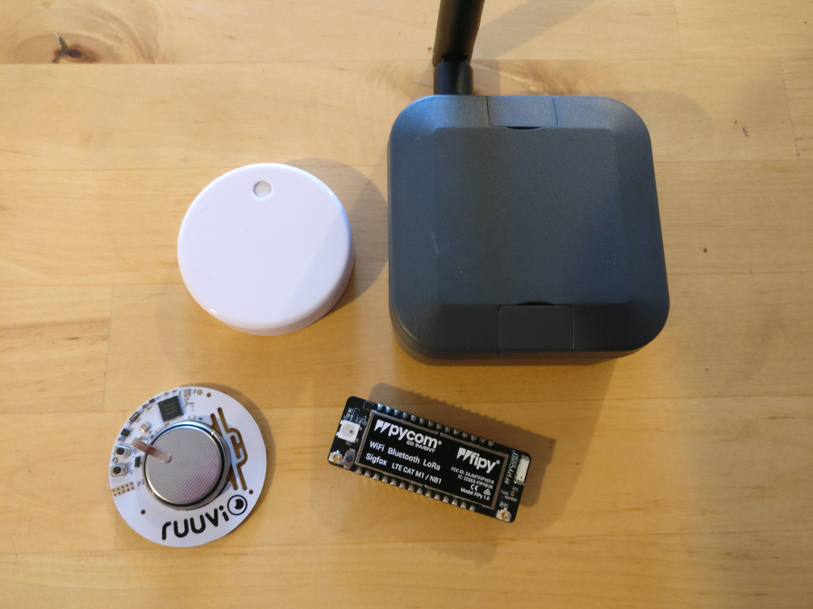

Publish RuuviTag sensor data on The Things Network
==================================================

In this tutorial we use a LoPy or FiPy to track temperature and humidity from a location with no WiFi and (in my case) no power supply socket and publish the `RuuviTag <https://tag.ruuvi.com/>`_ sensor data on `The Things Network <https://www.thethingsnetwork.org/>`_ with the `MicroPython RuuviTag Scanner <https://github.com/rroemhild/micropython-ruuvitag>`_.

This tutorial uses settings specifically for connecting to The Things Network within the European 868 MHz region. For another usage, please see the settings.py and node.py files for relevant sections that need changing.

.. note:: The code in this tutorial is not bounded to The Things Network and can also be used with other LoRaWAN networks.

.. toctree::
   :maxdepth: 2
   :caption: Contents:

This tutorial is made available under the `Creative Commons Attribution 4.0 International (CC BY 4.0) <https://creativecommons.org/licenses/by/4.0/>`_  license. Example code is made available under the MIT License.

Hardware
--------

* 1 x LoPy or FiPy from `pycom <https://pycom.io>`_
* 1 x LoRa Antena
* 1 x Expansion Board
* 1 x Case
* 1 x Lithium Ion Polymer Battery or battery pack
* 1 or more `RuuviTags <https://tag.ruuvi.com/>`_

TL;DR
-----

If you are familiar with MicroPython, LoPy, RuuviTag, TTN or just want to get started now, you can get the up to date snippets from the `tutorial repository <https://github.com/rroemhild/ruuvitag-ttn>`_ on GitHub. Modify the settings.py file and copy all \*.py files to your device.

LoRaWAN limitations
-------------------

LoRaWAN is limited on how much data can be send over the network. You can read more about the limitations on:

* `Best practices to limit application payloads <https://www.thethingsnetwork.org/forum/t/best-practices-to-limit-application-payloads/1302>`_
* `Limitations: data rate, packet size, 30 seconds uplink and 10 messages downlink per day Fair Access Policy <https://www.thethingsnetwork.org/forum/t/limitations-data-rate-packet-size-30-seconds-uplink-and-10-messages-downlink-per-day-fair-access-policy/1300>`_

In this tutorial we only want temperature and humidity from our tags. To save space we use the `RuuviTag Data Format 5 <https://github.com/ruuvi/ruuvi-sensor-protocols#data-format-5-protocol-specification>`_. But you can pack the data in any format you like or add more sensor data.

.. note:: A good goal is to keep the payload under 12 bytes. For temperature and humidity we need 2 bytes for each and one extra byte as a identifier, if we plan to scan more than one tag. In sum we have 5 bytes for each tag. As we don't need to send updates every minute we can add two or three more tags to the payload and send the measurements every 5 or 10 minutes.

Device setup
------------

If you are new to LoPy/FiPy, I recommend you start with `updating your device firmware <https://docs.pycom.io/chapter/gettingstarted/installation/firmwaretool.html>`_ and go on with `REPL & uploading code <https://docs.pycom.io/chapter/toolsandfeatures/repl/>`_. To upload code you can use `FTP <https://docs.pycom.io/chapter/toolsandfeatures/FTP.html>`_, the `Pymakr Plugins <https://docs.pycom.io/chapter/pymakr/>`_ or use something like the `mpfshell <https://github.com/wendlers/mpfshell>`_. I prefer mpfshell. With mpfshell you can easily manage the data on your device similar to an ftp client program and also access the REPL prompt.

After your are familiar with your device and updated to the latest firmware, it's time to install the `MicroPython RuuviTag Scanner <https://github.com/rroemhild/micropython-ruuvitag>`_. Copy the ``ruuvitag`` directory from the repository to your device ``/flash/lib/`` directory.

In example with mpfshell on Linux with the device connected to ``ttyUSB0``:

1. Clone the repository::

    git clone https://github.com/rroemhild/micropython-ruuvitag.git

2. Go to the module directory::

    cd micropython-ruuvitag
    cd ruuvitag

3. Copy the files to your device ::

    mpfshell ttyUSB0
    cd lib
    md ruuvitag
    cd ruuvitag
    mput .

TTN Device Registration
-----------------------

Before we can start hacking, we need to add our new device to The Things Network.

1. Start a MicroPython REPL prompt.
2. Run the following commands in the REPL:

    >>> import ubinascii
    >>> from network import LoRa
    >>> lora = LoRa(mode=LoRa.LORAWAN)
    >>> print(ubinascii.hexlify(lora.mac()).upper().decode('utf-8'))

This should print your Device EUI like::

    70B3D5499C89D4CE

3. Follow the steps to `register your device <https://www.thethingsnetwork.org/docs/devices/registration.html>`_.

.. note:: We'll use the Over The Air Activation (OTAA) to negotiate session keys for further communication.

Disable WiFi
------------

To disable wifi on boot, connect to the REPL prompt and run the following commands:

>>> import pycom
>>> pycom.wifi_on_boot(False)

This will disable WiFi on your pycom board and it will persist between reboots.

Hands on code
-------------

The device is ready, our TTN is setup, finally we can start add our code. We have 3 files: settings.py, node.py and main.py. Create these files on your workstation and copy them later to the device root (``/flash``) directory. The main.py is the file that run on each boot.

Configuration (settings.py)
~~~~~~~~~~~~~~~~~~~~~~~~~~~

This file contains settings for the device. As we use the OTAA activation copy the ``Application EUI`` and ``Application Key`` from the TTN console "device overview" to the appropriate variables.

The `RUUVITAGS` variable is used as a device whitelist for the RuuviTags you want to publish data. In our application we use the tuple index from the mac addresses as a device id. In example the first mac address is the device on the stable box and the second from the greenfield sites.

.. note:: Keep in mind that we want a small payload, only allow some tags to publish sensor data.

.. literalinclude:: ../settings.py

LoRaWAN node (node.py)
~~~~~~~~~~~~~~~~~~~~~~

This file contains the LoRaWAN network setup and don't need to be modified for the European 868 MHz region. The LoRaWAN class abstract the network access. I'll not get in details with this code to keep the focus on the RuuviTag code. In short this class handle the LoRaWAN setup for the European 868 MHz region, joins the network, prepare a socket and take care of the OTAA session keys.

.. literalinclude:: ../node.py

Main (main.py)
~~~~~~~~~~~~~~

The main.py file scans the RuuviTags in range, prepare sensor data and send the payload to The Things Network. To extend the battery life the device goes into deepsleep mode, wake up after 5 minutes and repeats.

We start to import required modules, node, settings and the RuuviTagScanner.

.. literalinclude:: ../main.py
    :lines: 1-7

Now we need to pack the sensor data. We use the data format from RuuviTag for temperature and humidity and add a tag id:

+--------+---------------------------------------------+
| Offset | Description                                 |
+========+=============================================+
| 0      | Tag ID (8bit)                               |
+--------+---------------------------------------------+
| 1-2    | Temperature in 0.005 degrees (16bit signed) |
+--------+---------------------------------------------+
| 3-4    | Humidity in 0.0025% (16bit unsigned)        |
+--------+---------------------------------------------+

In example for 2 RuuviTags the following payload will be send:

.. code-block:: python

   b'\x00\x11\x8aZ\xd0\x01\x06&y\xe0'

If we split this into parts, we get:

+------------------+------------------+
| Stable           | Greenfield sites |
+----+------+------+----+------+------+
| ID | Temp | Hum  | ID | Temp | Hum  |
+====+======+======+====+======+======+
| 00 | 118A | 5AD0 | 01 | 0626 | 79E0 |
+----+------+------+----+------+------+

To achieve this we add two functions to our code:

.. literalinclude:: ../main.py
    :lines: 10-21

To bring all the sensor data together we add a payload variable with an empty bytes objects, later we'll add the packed sensor data to this object:

.. literalinclude:: ../main.py
    :lines: 24

Now we initialize the `RuuviTagScanner`. Remember to not scan all the tags around you and add just the ones you need.

.. literalinclude:: ../main.py
    :lines: 26

We are setup and can start scanning for the tags and pack the data together. You can set a higher timeout in the settings.py file if your tag is on a longer range.

The tag id is his index from the whitelist tuple we set in `settings.RUUVITAGS`. When you unpack the payload on the target platform you have to remember the tag position from the tuple.

.. literalinclude:: ../main.py
    :lines: 30-34

When all tags where processed and our payload is ready, we setup up LoRaWAN and send out the payload.

.. literalinclude:: ../main.py
    :lines: 37,40

At the end we send the device into deepsleep mode for 5 minutes:

.. literalinclude:: ../main.py
    :lines: 43

The complete main.py file:

.. literalinclude:: ../main.py

Now reset your device and watch the incoming application data on the TTN console.

TTN Payload Format Decoder
--------------------------

On The Things Network Console we can now decode our payload with the following javascript example. Remember the position from each tag from the settings.RUUVITAGS variable, we will give them names in the decoded output.

.. code-block:: javascript

    function Decoder(bytes, port) {
      var ruuvitags = {};
      var tagname = "";
      var tags = bytes.length / 5;

      for (i=0;i<tags;i+=1) {
        var temperature = (bytes[1] << 8) | bytes[2];
        var humidity = (bytes[3] << 8) | bytes[4];

        if (bytes[0] === 0) {
          tagname = "stable";
        }
        else if (bytes[0] === 1) {
          tagname = "greenfield";
        }

        ruuvitags[tagname] = {
            "humidity": parseFloat((humidity * 0.0025).toFixed(2)),
            "temperature": parseFloat((temperature * 0.005).toFixed(2))
        };

        bytes.splice(0, 5);
      }

      return ruuvitags;
    }

1. Find out how many tags are included in the payload. Since we know that one tag use 5 bytes for payload, we divide the payload length with 5.

2. Iterate over the payload and unpack the data. In position zero we find the tag number from our tuple. We do a simple if-else match and give each RuuviTag a name.

3. Add the RuuviTag name with the measurements to the ``ruuvitags`` object, remove the first 5 bytes from ``bytes`` and iterate over the next payload data.

4. Return the decoded data.

When you take a look on the TTN Console Device Overview in the data section, you can see the incoming unpacked payload.
